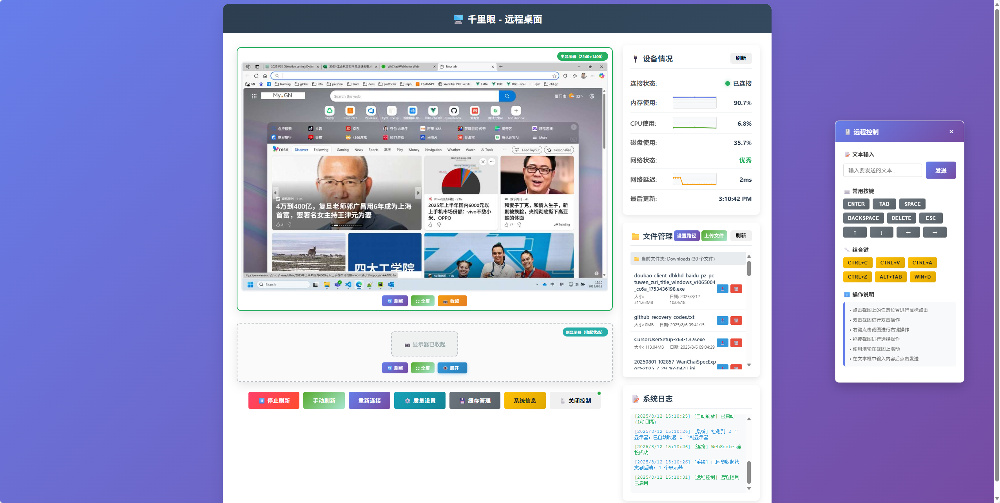

# 🖥️ Second Sight - 远程桌面监控系统

[](https://www.python.org/downloads/)
[](https://fastapi.tiangolo.com/)
[](LICENSE)



**Second Sight** 是一个功能强大的远程桌面监控和控制系统，基于Python FastAPI构建，提供实时屏幕截图、远程键鼠控制、文件管理、系统监控等核心功能。

## ✨ 主要特性

### 🖼️ 屏幕监控
- **多显示器支持**: 自动检测并支持多显示器配置
- **实时截图**: 支持单显示器和全桌面截图
- **智能缓存**: 图像缓存系统，优化传输性能
- **质量调节**: 可调节截图质量和压缩级别

### 🖱️ 远程控制
- **鼠标操作**: 点击、双击、右键、拖拽
- **键盘输入**: 文本输入、按键、组合键
- **滚轮控制**: 鼠标滚轮滚动
- **坐标转换**: 百分比坐标

### 📁 文件管理
- **文件上传**: 支持单文件和多文件上传
- **目录浏览**: 浏览系统目录和Downloads文件夹
- **文件操作**: 浏览、上传、下载、删除文件等
- **文件夹管理**: 创建、删除、浏览文件夹

### 📊 系统监控
- **实时状态**: CPU、内存、磁盘使用率
- **网络监控**: 网络连接状态和延迟检测
- **趋势图表**: 系统资源使用趋势可视化
- **WebSocket**: 实时数据推送

### 🔧 高级功能
- **多显示器管理**: 支持显示器折叠/展开
- **质量设置**: 可调节图像质量和传输参数
- **缓存管理**: 图像缓存统计和清理

## 🚀 快速开始

### 环境要求

- **操作系统**: Windows 10/11 (主要支持)
- **Python**: 3.8 或更高版本
- **内存**: 建议 4GB 以上
- **网络**: 支持局域网和互联网访问

### 安装步骤

1. **克隆项目**
```bash
git clone https://github.com/dylanz666/second-sight.git
cd second-sight
```

2. **安装依赖**
```bash
pip install -r requirements.txt
```

3. **启动服务**
```bash
python server.py
```

4. **访问应用**
打开浏览器访问: `http://localhost:8000`

## 📖 使用说明

### 基本操作

1. **启动服务**: 运行 `server.py` 或打包后的EXE文件
2. **访问界面**: 在浏览器中打开应用
3. **查看截图**: 自动显示桌面截图，支持多显示器
4. **远程控制**: 点击"远程控制"按钮启用键鼠控制
5. **文件管理**: 使用文件管理器上传和管理文件

### 远程控制模式

- **启用远程控制**: 点击"🖱️ 远程控制"按钮
- **鼠标操作**: 在截图上点击进行相应操作
- **键盘输入**: 使用文本输入框发送按键
- **组合键**: 支持Ctrl+C、Alt+Tab等组合键

### 多显示器支持

- **自动检测**: 系统自动检测显示器配置
- **独立控制**: 每个显示器可独立操作
- **折叠管理**: 支持隐藏不需要的显示器
- **配置调试**: 提供显示器配置诊断工具

## 🏗️ 项目结构

```
second-sight/
├── server.py                 # 主服务器文件
├── requirements.txt          # Python依赖
├── index.html                # 前端界面
├── static/                   # 静态资源
│   ├── styles.css            # 样式文件
│   └── js/                   # JavaScript模块
│       ├── core.js           # 核心功能
│       ├── monitor.js        # 显示器管理
│       ├── remote-control.js # 远程控制
│       ├── file-manager.js   # 文件管理
│       ├── settings.js       # 设置管理
│       └── websocket.js      # WebSocket通信
└── icon.ico                  # 应用图标
```

## 🔌 API接口

### 截图相关
- `GET /screenshot` - 获取桌面截图
- `GET /screenshot/monitor/{index}` - 获取指定显示器截图
- `GET /screenshots/all` - 获取所有显示器截图

### 远程控制
- `POST /remote/click` - 鼠标点击
- `POST /remote/type` - 文本输入
- `POST /remote/hotkey` - 组合键
- `POST /remote/scroll` - 滚轮滚动

### 文件管理
- `POST /upload` - 文件上传
- `GET /files` - 文件列表
- `DELETE /files/{filename}` - 删除文件
- `POST /create_folder` - 创建文件夹

### 系统监控
- `GET /status` - 系统状态
- `GET /system-info` - 系统信息
- `GET /monitors/config` - 显示器配置
- `WebSocket /ws` - 实时数据推送

## ⚙️ 配置选项

### 截图质量设置
```json
{
  "single_monitor": {
    "max_width": 1200,
    "max_height": 900
  },
  "desktop": {
    "max_width": 1600,
    "max_height": 1000
  },
  "png_quality": 60,
  "jpeg_quality": 60,
  "use_jpeg": true,
  "compression_level": 6
}
```

### 网络配置
- 默认端口: 8000
- 支持CORS跨域访问
- WebSocket实时通信
- 自动网络状态检测

## 🛠️ 开发指南

### 添加新功能

1. **后端API**: 在 `server.py` 中添加新的路由
2. **前端界面**: 在 `index.html` 中添加UI元素
3. **JavaScript**: 在相应的JS模块中实现功能
4. **样式**: 在 `styles.css` 中添加样式定义

### 调试

- 启用详细日志输出
- 使用浏览器开发者工具
- 检查WebSocket连接状态
- 验证显示器配置信息

## 🔒 安全考虑

- **访问控制**: 建议在生产环境中添加身份验证
- **网络隔离**: 可配置为仅局域网访问
- **文件权限**: 限制文件上传和访问范围
- **输入验证**: 所有用户输入都经过验证

## 📝 更新日志

### v1.0.0 (2024-12-19)
- ✨ 初始版本发布
- 🖼️ 多显示器截图支持
- 🖱️ 远程键鼠控制
- 📁 文件管理系统
- 📊 实时系统监控
- 🔧 质量设置和缓存管理

## 🤝 贡献指南

欢迎提交Issue和Pull Request！

1. Fork 项目
2. 创建功能分支 (`git checkout -b feature/AmazingFeature`)
3. 提交更改 (`git commit -m 'Add some AmazingFeature'`)
4. 推送到分支 (`git push origin feature/AmazingFeature`)
5. 打开 Pull Request

## 📄 许可证

本项目采用 MIT 许可证 - 查看 [LICENSE](LICENSE) 文件了解详情。

## 📞 联系方式

- 项目主页: [GitHub Repository](https://github.com/dylanz666/second-sight)
- 问题反馈: [Issues](https://github.com/dylanz666/second-sight/issues)

## 🙏 致谢

感谢以下开源项目的支持：

- [FastAPI](https://fastapi.tiangolo.com/) - 现代、高性能的 Python Web 框架，为 API 开发提供快速便捷的解决方案
- [Uvicorn](https://www.uvicorn.org/) - 闪电般快速的 ASGI 服务器，为 FastAPI 提供可靠的运行环境
- [pywin32](https://github.com/mhammond/pywin32) - 提供 Windows 系统 API 访问能力，助力系统级功能实现
- [psutil](https://psutil.readthedocs.io/) - 跨平台系统监控库，轻松获取进程和系统资源信息
- [PyAutoGUI](https://pyautogui.readthedocs.io/) - 简单易用的跨平台 GUI 自动化工具，实现鼠标、键盘操作控制
- [requests](https://requests.readthedocs.io/en/latest/) - 优雅的 HTTP 库，简化网络请求处理流程
- [OpenCV-Python](https://github.com/opencv/opencv-python) - 强大的计算机视觉库，提供丰富的图像处理能力
- [NumPy](https://numpy.org/) - 科学计算的基础库，为数据处理和数值运算提供高效支持
---

这些优秀的开源项目为 "千里眼 (远程桌面)" 的开发提供了坚实的技术基础，极大地提升了开发效率和产品质量。向所有项目的开发者和贡献者致以诚挚的感谢！

⭐ 如果这个项目对你有帮助，请给它一个星标！
